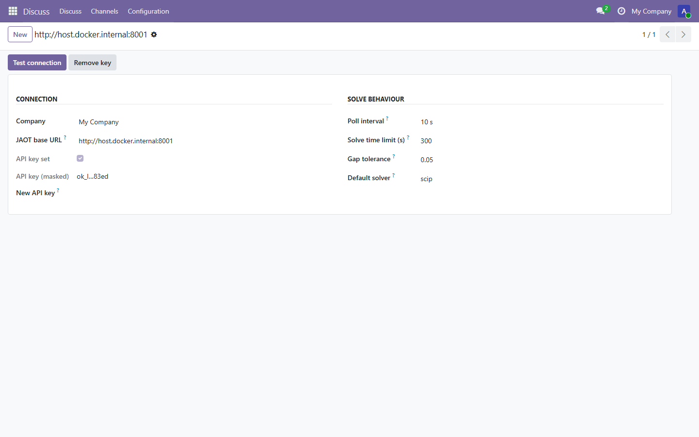
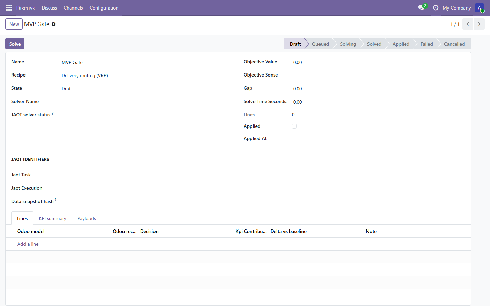
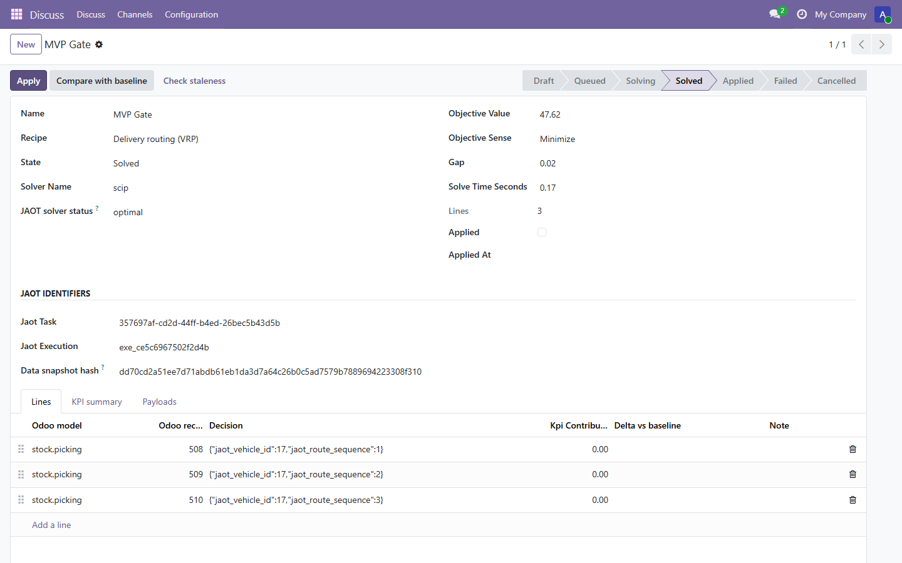
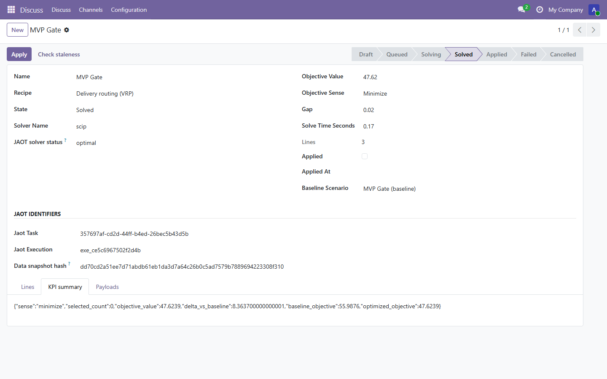
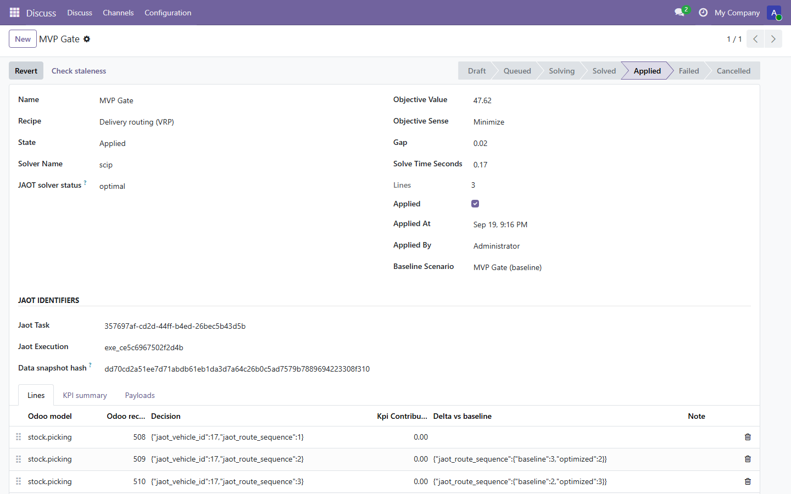
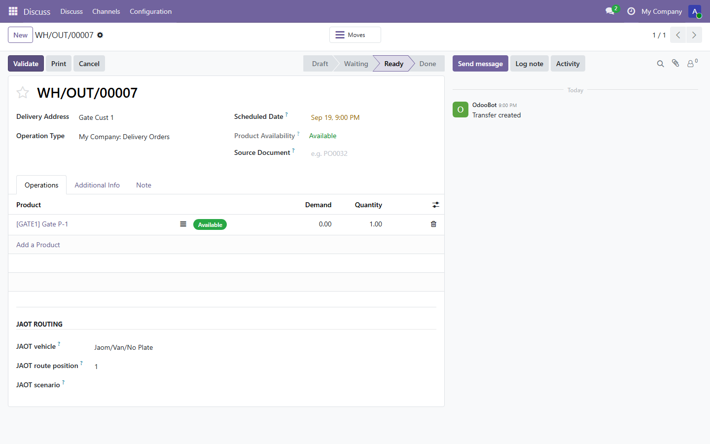
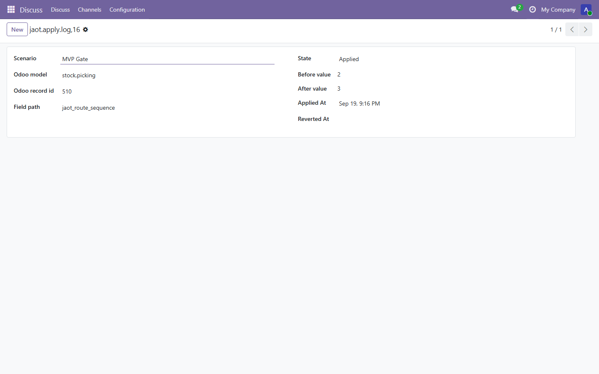
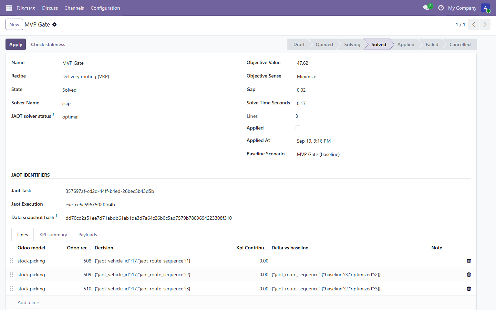
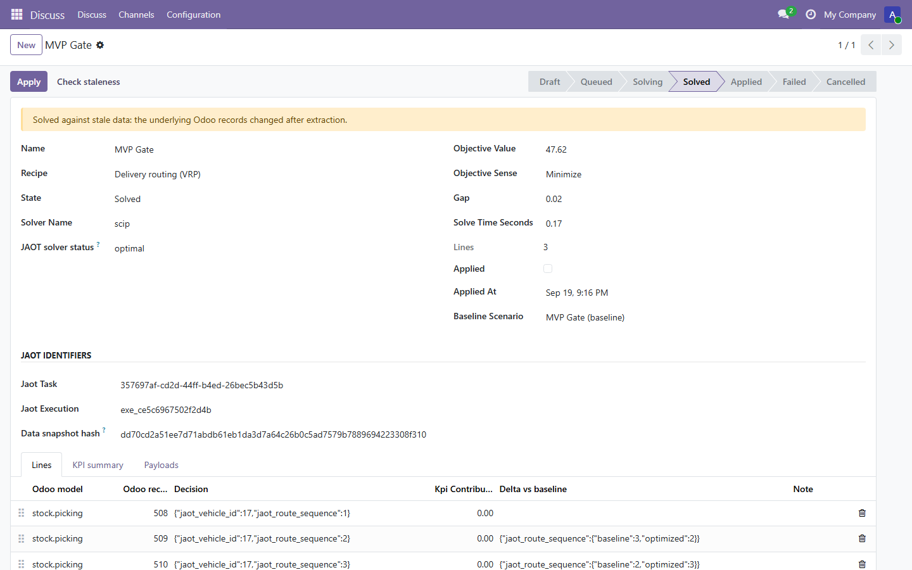

# MVP acceptance gate (PLAN P3.8)

This is the record of the **P3.8 MVP gate**: the SPECS §11.1 acceptance flow,
run end to end on the dev stack (Odoo 19 + a reachable JAOT) and captured with
screenshots. Run on 2026-09-19 via Playwright against the live `odoo` database.

The gate covers the core routing flow **and** the baseline comparison
("diff vs baseline", SPECS §11.1 step 1, implemented in P4.1/P4.2). The
staleness warning (SPECS §4.6) is shown at the end.

**Dataset.** Three confirmed/assigned outgoing pickings (508, 509, 510), each
with a destination partner that has coordinates and a shipping weight, one
active `fleet.vehicle` (17), and a depot warehouse contact with coordinates.
An incumbent plan was written on the pickings in a deliberately suboptimal
order so the optimized solution and the baseline differ.

## 1. JAOT connection (01)

`JAOT → Configuration → JAOT connection`: the endpoint is set, the API key is
stored (shown masked), and the default solver is `scip`.

## 2. Draft scenario (02)

A scenario on the `vrp` recipe, in `draft`. The recipe extracts its data from
the company's pickings, warehouse and fleet via its bindings (SPECS §4.1), so
no source list is set on the scenario itself.

## 3. Solved (03)

**Solve** submits the extracted problem to JAOT. After the reconciliation the
scenario is `solved`: solver `scip`, status `optimal`, objective `47.62`
(haversine distance, minimised). The line view shows one line per picking with
the assigned vehicle and route position:

- 508 → vehicle 17, position 1
- 509 → vehicle 17, position 2
- 510 → vehicle 17, position 3

This is the decision view that is the product.

## 4. Diff vs baseline (04)

**Compare with baseline** re-solves the recipe with every decision pinned to
the incumbent plan (the fix-all baseline, SPECS §4.6 / P4.1). The optimized and
baseline objectives and their delta are stored on the scenario:

- optimized objective: `47.62`
- baseline objective: `55.99`
- delta vs baseline: `8.36` (the incumbent plan is 8.36 units worse)

The KPI summary carries `objective_value`, `baseline_objective`,
`optimized_objective` and `delta_vs_baseline`; each line also carries its own
`delta_vs_baseline`.

## 5. Apply (05, 06)

**Apply** (manager only) writes each picking with its vehicle and route
position from the solved lines. The picking form shows the `JAOT routing`
fields populated.

## 6. Apply log (07)

`JAOT → Apply log`: one row per written field, with the before and after
values. The apply produced six rows (three pickings, vehicle + position).

## 7. Revert (08)

**Revert** returns every picking to its before-state (the incumbent plan) and
stamps the apply-log rows. The scenario goes back to `solved`.

## 8. Staleness (09, SPECS §4.6)

After extraction, one picking's weight was changed. **Check staleness** then
flags the scenario: "Solved against stale data: the underlying Odoo records
changed after extraction." The warning appears at the top of the form.

## Result

The acceptance flow runs end to end: configure, solve, review the decision,
diff against the baseline, apply, audit, revert, and detect staleness. The
apply/revert round-trip was verified against the incumbent plan.
